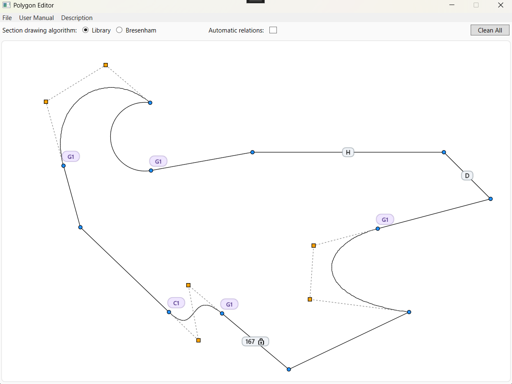
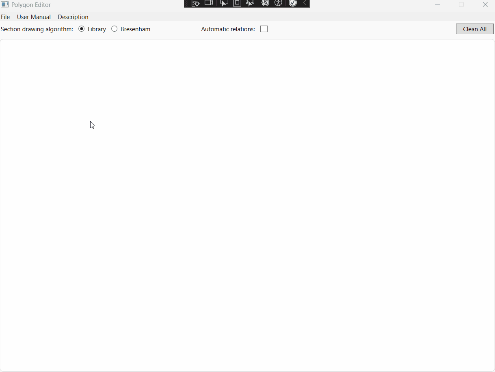
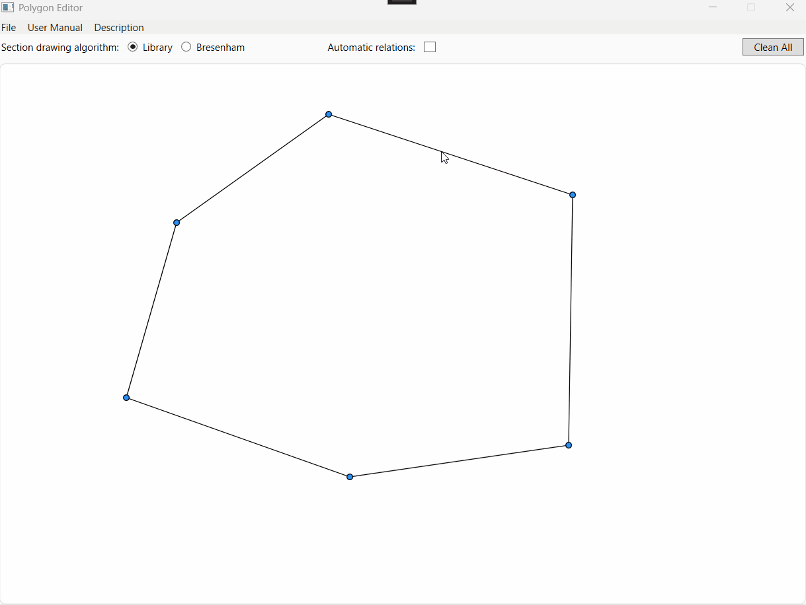
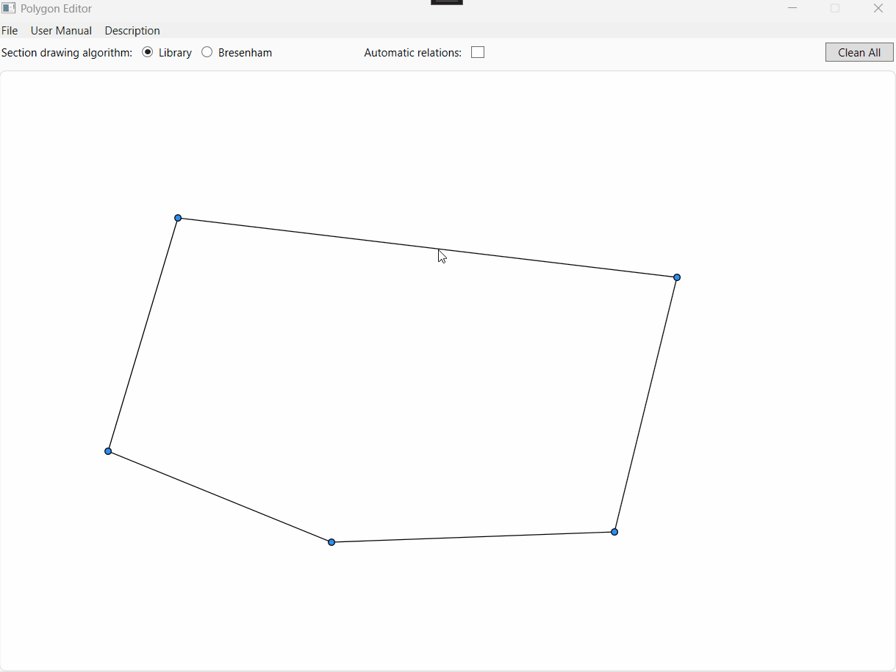
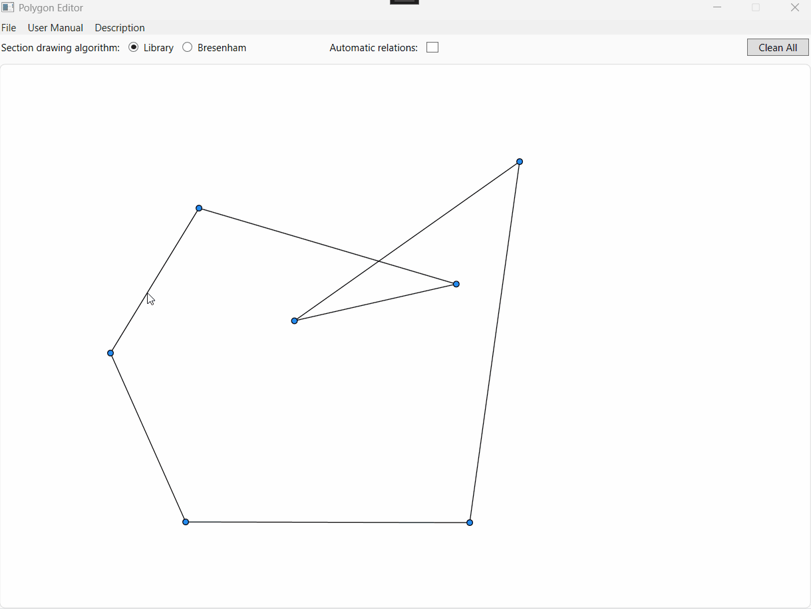
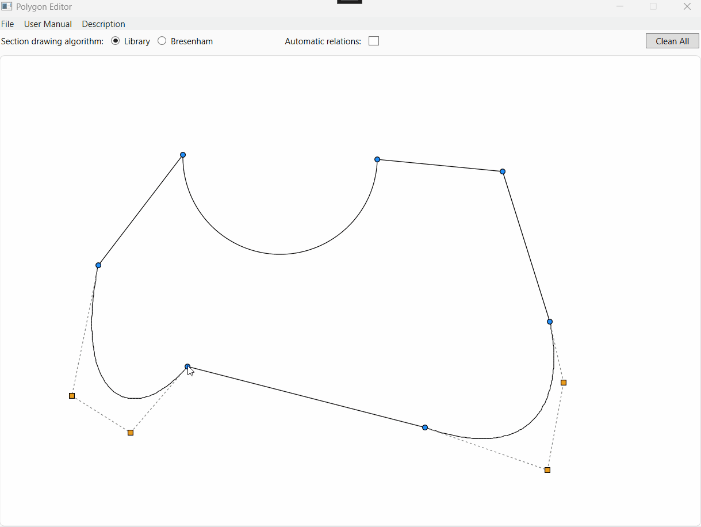
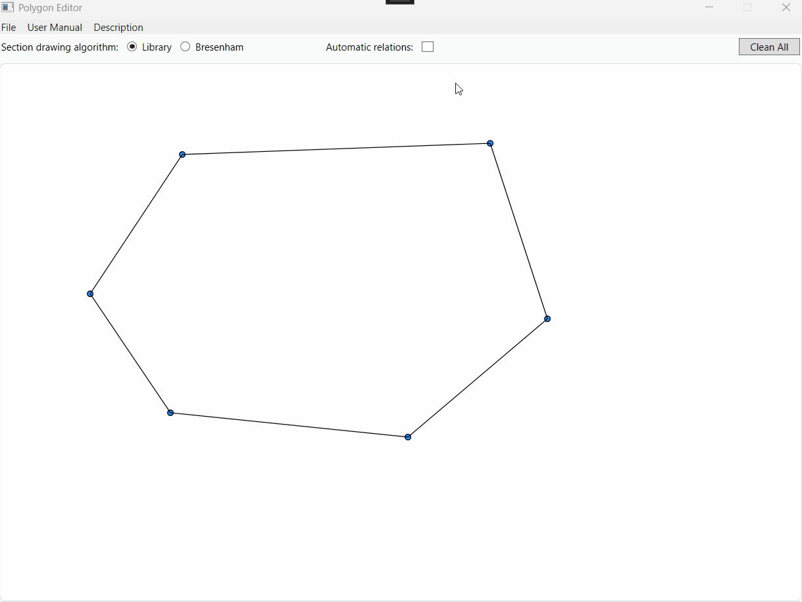

# Polygon Editor

**Polygon Editor** is a pretty simple WPF and C# application designed to create and edit different polygons.

I created this project as a 1st part of Computer Graphics course at Warsaw University of Technology (WUT) during the 5th semester of Computer Science bachelor studies (2025/2026 academic year). 

## Main idea
The main idea of this WPF application is to allow users to easily *create* and *edit* any type of polygon (convex, concave, self-intersecting) by simply clicking the mouse on the canvas. 

The users are provided with a set of tools to manipulate the vertices of the polygons. There is also a possibility to transform some edges of the polygon into Bezier curves or Arcs. 

Simple and user-friendly UI is designed to make the process of creating and editing polygons as intuitive as possible.

## Example of usage

## Technical features

1. **Polygon creation**: Users can **create polygons** by clicking on the canvas to add vertices. The application supports both convex and concave polygons, as well as self-intersecting ones. After the user finishes a definition of the polygon (**by clicking the first vertex again**), the polygon is automatically closed and **displayed** on the canvas.

2. **Vertex manipulation**: Users can **drag and drop** any vertex to change the shape of the polygon. **New vertices** can be **added** and **existing ones removed** as well (by right-clicking on the vertex and selecting the appropriate option from the context menu).

3. **Edge constraints**: Any edge of the polygon can be transformed into:
    + *Horizontal line* (the edge will be always parallel to the X-axis)
    + *Diagonal line* (the edge will have 45° angle with the X-axis)
    + *Fixed-length line* (the edge will have a constant length, which can be defined by the user)

4. **Vertex continuity**: Each vertex can possess a certain **continuity type**:
    + *C0 continuity* (the vertex can be moved freely without any constraints)
    + *C1 continuity* (the vertex will maintain a smooth transition between adjacent edges, ensuring that the angles between them remain consistent)
    + *G1 continuity* (similar to C1, but allows for adjusent edges to be of different lengths)

5. **Bezier curves and Arcs**: Users can **transform any edge** of the polygon into a **Bezier curve** or an **Arc**. This allows for creating more complex and smooth shapes.

6. **Automatic relations**: There is a possibility to check/uncheck the option of **automatic relations** on top of the manage panel. When this option is enabled, the user changes the position of a vertex and *an edge becomes nearly diagonal or horizontal during the movement*, the application will automatically change the edge type to diagonal or horizontal respectively. 

7. **Clockwise propagation**: When a certain vertex is being moved, not only 2 adjacent edges must be updated, but also the next ones in a clockwise direction. There is a static class `RelationPropagationResolver` responsible for this propagation.

8. **Drawing algorithm**: The application provides a user with a possibility to choose between two different algorithms for drawing polygons: **Bresenham's line algorithm** and **library method** (Bresenham with anti-aliasing de facto).

## Interactive features
| 1. Defining Polygon | 2. Vertex Manipulation | 
| :---: | :---: | 
|  |  | 
| *Create a polygon/move some vertices* | *Add/Remove vertices or clear the entire canvas.* |
| 3. Edge Constraints | 4. Bezier Curves and Arcs |
|  |  |
| *Transform edges into horizontal, diagonal or fixed-length lines.* | *Transform edges into Bezier curves or Arcs.* |
| 5. Vertex continuity | 6. Automatic relations |
|  |  |
| *Set the continuity type of vertices.* | *Enable/Disable automatic relations between edges.*

## Requirements and setup
- **.NET 8.0** or higher & **Visual Studio 2022** or higher (or any other compatible IDE)
- To run: simply clone the repository, open the `.sln` file in Visual Studio, build the solution and run the application.

---

## Academic context
This project was developed for the *Computer Graphics* course at Warsaw University of Technology (WUT) during the 5th semester of Computer Science bachelor studies (2025/2026 academic year). 
- *Faculty*: Faculty of Mathematics and Information Science
- *Supervised by*: Dr. inż. **Paweł Kotowski**
- *Grade received*: 18/25 (72%)

## Contact
Feel free to contact me if you have any suggestions or questions regarding the project:
- **Github**: [@uasuna2022](https://github.com/uasuna2022)
- **Email**: [max.gomanchuk@gmail.com](mailto:max.gomanchuk@gmail.com)
- **Instagram**: [@m_a_k_s_i_m_g](https://www.instagram.com/m_a_k_s_i_m_g/)

